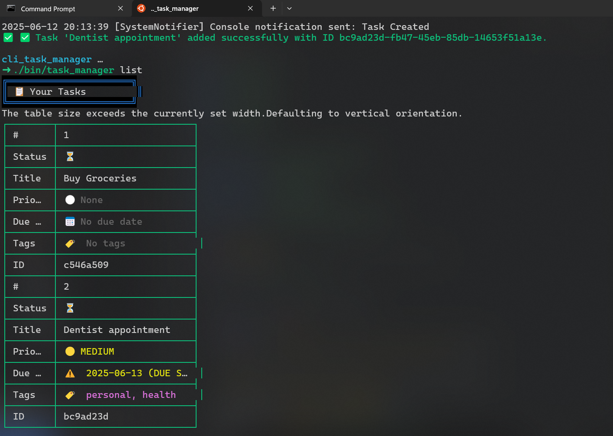

# 🚀 CLI Task Manager

A powerful, feature-rich command-line task management application built with Ruby. Manage your tasks efficiently with a beautiful CLI interface, robust data persistence, and advanced task organization features.



## ✨ Features

- 🔐 **Secure User Management**

  - User registration and authentication
  - Secure password hashing with bcrypt
  - Session management with auto-login

- 📝 **Advanced Task Management**

  - Create, read, update, and delete tasks
  - Set due dates, priorities, and tags
  - Support for recurring tasks
  - Parent-child task relationships
  - Task status tracking (pending/completed)

- 🎯 **Smart Task Organization**

  - Filter tasks by status, tags, and due dates
  - Sort tasks by various criteria
  - Overdue task highlighting
  - Priority-based task management

- 📊 **Data Management**

  - SQLite database with ActiveRecord ORM
  - Import/Export tasks in CSV format
  - Robust error handling and logging

- 🎨 **Beautiful CLI Interface**
  - Color-coded output for better readability
  - Interactive prompts for user input
  - Progress indicators and status messages
  - Comprehensive help system

## 🛠️ Installation

1. Clone the repository:

```bash
git clone https://github.com/emmanuelallan/cli_task_manager.git
cd cli_task_manager
```

2. Install dependencies:

```bash
bundle install
```

3. Make the CLI executable:

```bash
chmod +x bin/task_manager
```

## 🚀 Usage

### Basic Commands

```bash
# Register a new user
task_manager register

# Login to your account
task_manager login

# Add a new task
task_manager add "Buy groceries" --due-date 2024-03-20 --priority high --tags shopping,food

# List all tasks
task_manager list

# Show task details
task_manager show TASK_ID

# Complete a task
task_manager complete TASK_ID

# Edit a task
task_manager edit TASK_ID --title "New title" --priority medium

# Delete a task
task_manager delete TASK_ID
```

### Advanced Features

```bash
# Filter tasks
task_manager list --completed
task_manager list --pending
task_manager list --overdue
task_manager list --tag shopping

# Sort tasks
task_manager list --sort-by due_date
task_manager list --sort-by priority
task_manager list --sort-by created_at

# Export tasks
task_manager export csv my_tasks.csv

# Import tasks
task_manager import csv my_tasks.csv
```

## 🏗️ Architecture

The application follows a clean, modular architecture:

- **CLI Layer**: Handles user interaction and command parsing
- **Service Layer**: Implements business logic
- **Model Layer**: Manages data and persistence
- **Persistence Layer**: Handles database operations

## 🔧 Development

### Prerequisites

- Ruby 3.0 or higher
- Bundler
- SQLite3

### Running Tests

```bash
bundle exec rspec
```

### Code Style

The project follows Ruby best practices and uses RuboCop for code style enforcement:

```bash
bundle exec rubocop
```

## 📝 License

This project is licensed under the MIT License - see the LICENSE file for details.

## 🤝 Contributing

Contributions are welcome! Please feel free to submit a Pull Request.

1. Fork the repository
2. Create your feature branch (`git checkout -b feature/amazing-feature`)
3. Commit your changes (`git commit -m 'Add some amazing feature'`)
4. Push to the branch (`git push origin feature/amazing-feature`)
5. Open a Pull Request

## 🙏 Acknowledgments

- [Thor](https://github.com/rails/thor) for CLI framework
- [TTY-Prompt](https://github.com/piotrmurach/tty-prompt) for interactive prompts
- [ActiveRecord](https://github.com/rails/rails/tree/main/activerecord) for database operations
- [Colorize](https://github.com/fazibear/colorize) for terminal colors

---

Made with ❤️ by Emmanuel Allan
